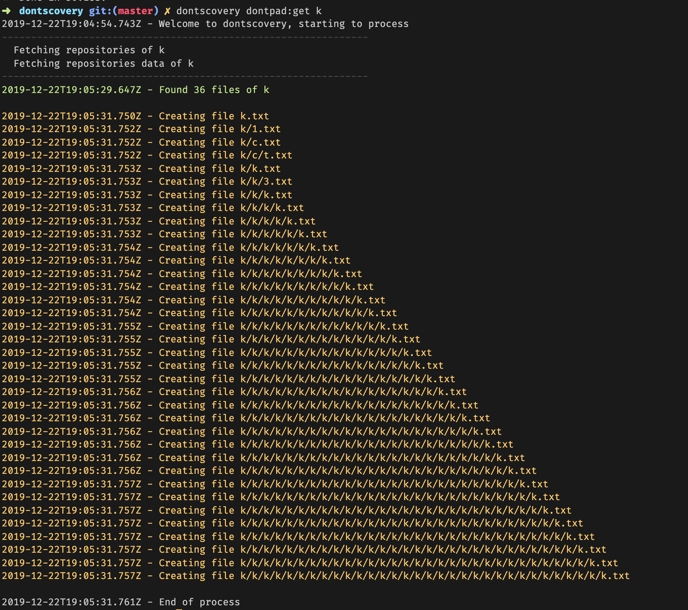

### Dontpad-Discovery - dontscovery
    

 A dontpad discovery folders and download content built with gluegun. 

  
  

## :bulb: Introduction 

dontscovery is a simple CLI tool to get easily one or many files inside a folder and subfolders, that would be saved in a txt file.

How it works: use one of commands listed bellow, after processed will create a folder **data** with all files inside, even if exists many subdirectories dontscovery is capable to find and get all the data nested, as you can see in this awesome example.

**Note**: *This is a unofficial dontpad tool, and was made for study purpose.*

## :house: Getting started

1. Install the package using NPM/YARN with `npm -i dontscovery -g` or `yarn add global dontscovery`
2. Check the commands available with `dontscovery -h`
3. Run the commands you want.
4. After run some of commands bellow, will create a folder.

## :zap: Commands
- `dontscovery` - Basically is a welcome message, to know if installation worked well.
- `dontscovery -h` - Will list all available commands and related descriptions.
- `dontscovery:get` - Used to get **one** user content, `dontscovery:get keven`
- `dontscovery:many` - Used to get one or many users content `dontscovery:many keven,leone,santos`, this process will find and download content of specified users, sepated by comma **,**
- `dontscovery-random` - Get a random and brazilian user. Also is possible to specify how many randoms you want, like: `dontscovery-random 10`

## :handshake: **Contributing**
If you liked the project and want to cooperate feel free to fork this repository and send Pull Requests.

All kinds of contributions are very welcome and appreciated

-   ⭐️ Star the project
-   🐛 Find and report issues
-   📥 Submit PRs to help solve issues or add features

## :book: License
MIT license, Copyright (c) 2019 Keven Leone.